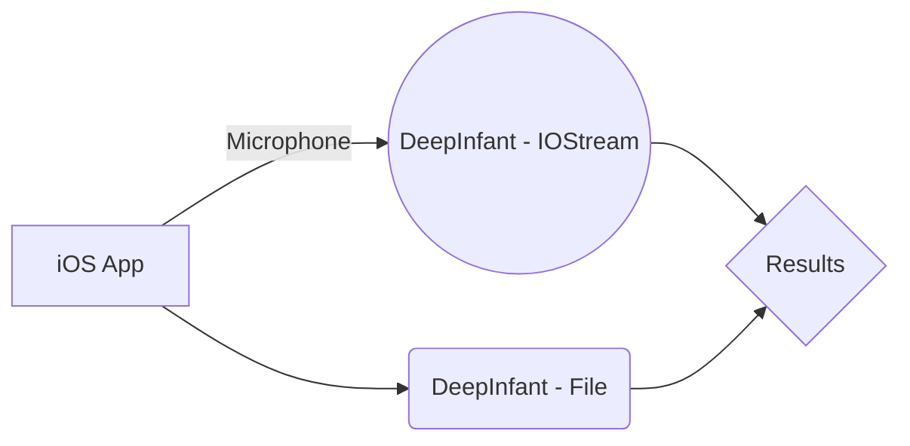

# DeepInfant

DeepInfant® is a Neural network system designed to predict whether and why your baby is crying.


DeepInfant uses artificial intelligence and machine learning algorithms to determine which acoustic features are associated with which one of baby's needs.

For example, babies who are in pain demonstrate cries with high energy, while a fussy cry may have more periods of silence. We are preparing our findings for academic review and publication within a single well trained model based on academic datasets.


  ## How it works!
  


  

## Dataset
DeepInfant has used as part of final project in Speech Technology Course in KTH (Royal Institute of Technology Sweden)

## iOS Models
This repo is published with pre-trained CoreML Models.

* DeepInfant_VGGish
* DeepInfant_AFP


| DeepInfant_VGGish  | DeepInfant_AFP  |
| :-: | :-: |
| Trained with a feature extractor that uses extra layers for classification with a fixed window duration of 975ms | Trained with a feature extractor that optimized for speed with support of a flexible window duration. |

## Building a model

The audio clips have a sample rate of 16000 Hz and a duration of about ~7 secs. This means there are about 16000*7 numbers per second representing the audio data. We take a fast fourier transform (FFT) of a 2048 sample window, slide it by 512 samples and repeat the process of the 7 sec clip. The resulting representation can be shown as a 2D image and is called a Short-Time Fourier Transform (STFT). Since humans perceive sound on a logarithmic scale, we’ll convert the STFT to the [mel scale](https://en.wikipedia.org/wiki/Mel_scale). The  [librosa](https://librosa.github.io/librosa/)  library lets us load an audio file and convert it to a melspectrogram
 
 ```python
import librosa
import librosa.display

fname = 'test-1-audio001.wav'
samples, sample_rate = librosa.load(fname)
fig = plt.figure(figsize=[4,4])
ax = fig.add_subplot(111)
ax.axes.get_xaxis().set_visible(False)
ax.axes.get_yaxis().set_visible(False)
ax.set_frame_on(False)
S = librosa.feature.melspectrogram(y=samples, sr=sample_rate)
librosa.display.specshow(librosa.power_to_db(S, ref=np.max))
```

The `melspectrogram` of a baby crying looks like the image below


In order to build the spectrograms of the audio samples needed for training the model, we’ll be using the fantastic  [audio loader module for fastai v1 built by Jason Hartquist](https://github.com/sevenfx/fastai_audio).

```python
n_fft = 2048 # output of fft will have shape [1024 x n_frames]
n_hop = 512 # 50% overlap between frames
n_mels = 128 # compress 2048 dimensions to 128 via mel frequency scale
sample_rate = 16000
tfms = get_frequency_batch_transforms(n_fft=n_fft, n_hop=n_hop,
              n_mels=n_mels, sample_rate=sample_rate)
batch_size = 64
data = (AudioItemList.from_folder(CRYING_PATH)
     .split_by_folder()
     .label_from_folder()
     .databunch(bs=batch_size, tfms=tfms, equal_lengths=False))
learn = create_cnn(data, models.resnet34, metrics=accuracy)
learn.lr_find(start_lr=0.001, end_lr=1)
learn.recorder.plot()
```

Fastai’s cyclical learning rate finder runs the model against a small batch of training samples to find a good learning rate.


As the learning rate increases to 10e-2, you can see the model loss decrease. However, for higher learning rates, the loss begins to increase. Hence we pick 10e-2 as the learning rate for training the model.
After training the model over a few epochs, we see an accuracy of 95% over the validation set


  
### Predicting over realtime audio samples

Now that we have a really good model, in order to use it in a real application, we need to be able to run predictions over an audio stream in real time.

We use the  [pyaudio](https://people.csail.mit.edu/hubert/pyaudio/docs/)  library to read audio samples from the device microphone and then convert the audio data into numpy arrays and feed it to the model.

```python
while True:
frames = [] # A python-list of chunks(numpy.ndarray)
for _ in range(0, int(RATE / CHUNKSIZE * RECORD_SECONDS)):
    data = stream.read(CHUNKSIZE, exception_on_overflow=False)
    frames.append(np.fromstring(data, dtype=np.float32))
    npdata = np.hstack(frames)
    audio_clip = AudioClip.from_np(npdata, RATE)
    run_pred(audio_clip)
```
The above code reads a 7 sec audio clip from the microphone and loads that into memory. It converts it to a numpy array and runs the model on them to get a prediction. This simple piece of code is now ready to be deployed to a service or an embedded device and be used in real applications !


## Convention

The audio files should contain baby cry samples, with the corresponding tagging information encoded in the filenames. The samples were tagged by the contributors themselves. So here's how to parse the filenames.


iOS:
```
0D1AD73E-4C5E-45F3-85C4-9A3CB71E8856-1430742197-1.0-m-04-hu.caf
```
app instance uuid (36 chars)-unix epoch timestamp-app version-gender-age-reason
So, the above translates to:

the sample was recorded with the app instance having the unique id 0D1AD73E-4C5E-45F3-85C4-9A3CB71E8856. These ids are generated upon installation, so they identify an installed instance, not a device or a user
the recording was made at 1430742197 (unix time epoch) , which translates to Mon, 04 May 2015 12:23:17 GMT

version 1.0 of the mobile app was used, the user tagged the recording to be of a boy, the baby is 0-4 weeks old according to the user, the suspected reason of the cry is hunger

Android:
```
0c8f14a9-6999-485b-97a2-913c1cbf099c-1431028888092-1.7-m-26-sc.3gp
```
The structure is the same with the exception that the unix epoch timestamp is in milliseconds

### Tags

#### Gender

- m - male
- f - female

#### Age

- 04 - 0 to 4 weeks old
- 48 - 4 to 8 weeks old
- 26 - 2 to 6 months old
- 72 - 7 month to 2 years old
- 22 - more than 2 years old

#### Reason

- hu - hungry
- bu - needs burping
- bp - belly pain
- dc - discomfort
- ti - tired


## License
Apache License
Version 2.0, January 2004
http://www.apache.org/licenses/

   Copyright 2022 Skytells AI Research

   Licensed under the Apache License, Version 2.0 (the "License");
   you may not use this file except in compliance with the License.
   You may obtain a copy of the License at

       http://www.apache.org/licenses/LICENSE-2.0

   Unless required by applicable law or agreed to in writing, software
   distributed under the License is distributed on an "AS IS" BASIS,
   WITHOUT WARRANTIES OR CONDITIONS OF ANY KIND, either express or implied.
   See the License for the specific language governing permissions and
   limitations under the License.
